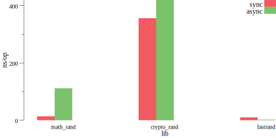

# How Fast ?

How fast is each Golang package? And if they were compared, how would it be? (golang lib benchmark comparison)

## Test Environment

- CPU: Apple M1 chip (8 cores)
- Memory: 16 GB LPDDR4X-4266 MHz
- Go: go1.18.4 darwin/arm64
- OS: macOS Monterrey 12.3.1

## Random

## Concurrent Map

