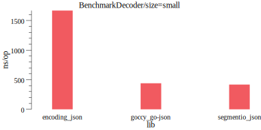

# JSON Serialization

only JSON encoder/decoder that compatible with `encoding/json`

## Encoder


## Decoder




```shell
$ go test -benchmem -run=^$ -bench . ./json > ./json/benchmark.txt

$ benchdraw --filter="BenchmarkEncoder/size=large" --x=lib  --y="ns/op" --input=./json/benchmark.txt --output=./json/benchmark_encoder_large.svg
$ benchdraw --filter="BenchmarkEncoder/size=small" --x=lib  --y="ns/op" --input=./json/benchmark.txt --output=./json/benchmark_encoder_small.svg

$ benchdraw --filter="BenchmarkDecoder/size=large" --x=lib  --y="ns/op" --input=./json/benchmark.txt --output=./json/benchmark_decoder_large.svg
$ benchdraw --filter="BenchmarkDecoder/size=small" --x=lib  --y="ns/op" --input=./json/benchmark.txt --output=./json/benchmark_decoder_small.svg
```
